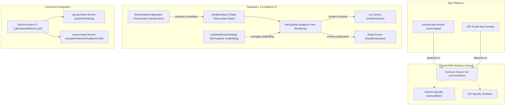

# KMP Template: Navigation 3 & Adaptive Layout

A modern, production-ready **Kotlin Multiplatform (KMP)** application template for Android and iOS. This project features a shared presentation and business logic layer, a shared Compose Multiplatform UI, a state-driven **Jetpack Navigation 3** architecture with **Material 3 Adaptive Layouts**, and concurrent **GitHub Actions CI**.

---

## 📐 System Architecture

The project is structured to share 100% of the UI and business logic while retaining native integration on both Android and iOS platforms. Below is an architectural overview mapping the multiplatform modules, the newly migrated Navigation 3 adaptive routing engine, and the automated CI/CD pipeline:

---

## ✨ Features

- **Jetpack Navigation 3**: A modern, state-driven navigation engine that replaces standard event-based routing with explicit, user-owned Compose back stack states (`SnapshotStateList`).
- **Material 3 Adaptive Layout**: Utilizes the `ListDetailSceneStrategy` to render list and detail screens side-by-side on wide-screen devices (tablets, foldables, desktop windows) and seamlessly degrades to a single-pane stack on mobile phones.
- **Cross-Platform State Persistence**: Features custom `SavedStateConfiguration` utilizing `SerializersModule` to guarantee robust polymorphic serialization across Android and iOS native targets.
- **Robust Parallel CI/CD**: Dual-job workflow verifying Android compilation on Linux and iOS compilation on macOS in parallel.

---

## 🛠️ Getting Started

### Prerequisites
- **JVM 17 or higher** is strictly required to run Gradle 9.4.1 locally. Make sure to configure your system `JAVA_HOME` or your IDE (Android Studio / IntelliJ IDEA) Gradle JDK to point to JDK 17+.

### Building the Project
Always build using the Gradle wrapper (`./gradlew`):
- **Assemble All Targets**: `./gradlew assemble`
- **Build Android Debug App**: `./gradlew :androidApp:assembleDebug`
- **Compile iOS Simulator Shared Library**: `./gradlew :shared:compileKotlinIosSimulatorArm64`
- **Clean Build Outputs**: `./gradlew clean`

---

## 🤖 Continuous Integration

Continuous integration is automated via GitHub Actions in [.github/workflows/ci.yml](.github/workflows/ci.yml) and runs on every push and pull request targeting the `main` branch. 

To ensure optimal speed and resource efficiency, the build is split:
1. **Android Build**: Executed on a fast Linux (`ubuntu-latest`) runner.
2. **iOS Build**: Executed on a macOS (`macos-latest`) runner with full Apple Developer Tooling support.
